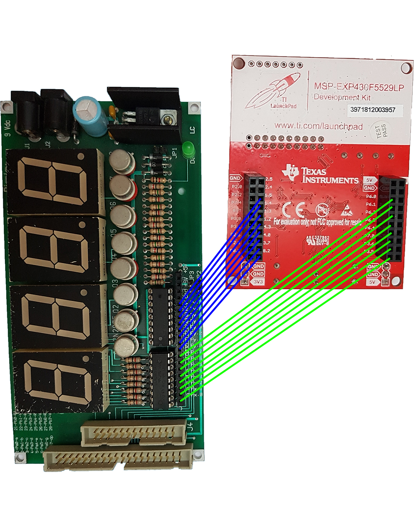

# MSP430 4 x 7_segment_display
This is a library for MSP430F5529 that allows to drive boards with four 7 segments displays.
It includes C functions to handle connection between MSP430 and the board; it also provides means to display strings and integers on four seven segments displays, in many different ways.

## Getting Started
This section provides essential instructions on how to use this library

### Scheme

### Importing
To use this library you have to `#include "display7x4.h"`

### Requirements and Building
The `display7x4.c` library contains no external dependencies, it only requires one of the following compler to be built successfully:
 - GNU for msp430f5529
 - TI compiler for msp430f5529

I suggest you to work on either CCS or IAR environments

### How to use it
Keep in mind to call the `init()` function before using any function defined in the library.
This function is meant to initialize all the pins needed by the other functions.

##  Running the tests
First of all, you can test if the environment is configurated properly by running the `main.c` program.
You can find all examples on master -> Examples.

### Stopwatch
Run master -> Examples -> Stopwatch -> main.c

### Digital Clock
Run master -> Examples -> Digital_Clock -> main.c
Press button S2 to stop clock's ticking and enter the setting mode.
Press button S1 to increase the value of a digit during the setting.

## Functions

## Authors

 - Francesco Mecatti - I.T.I.S Enrico Fermi - Italy, Modena

## License
This project is licensed under the MIT license - see the [LICENSE.md](license.md) file for details
